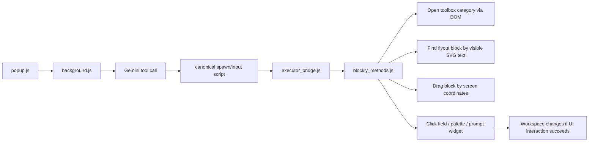
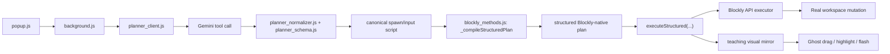
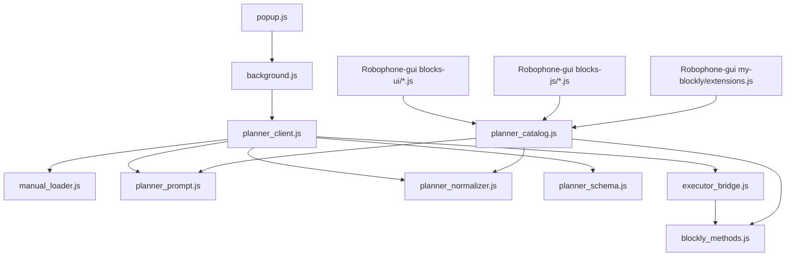
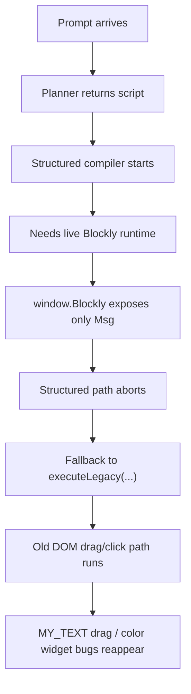

# Blockly Extension Architecture

## Purpose

This document explains:

- how the **previous** Chrome extension architecture worked
- how the **current hybrid** architecture is intended to work
- why the new architecture is structurally better
- why it is **currently falling back** to the legacy path on `staging.code.robo-phone.com`
- what runtime facts we still need to discover to make the structured executor work reliably

The goal of the extension is educational:

- the student should see blocks being built visually
- the system should still be robust enough to work across many block families

That leads to the current target design:

- **correctness path**: structured Blockly execution
- **presentation path**: visible teaching drag / highlight animation

## Repo Components

### Extension files

- [popup.html](/Users/arnoldcheskis/Documents/Projects/Archive/Robophysics/extension/popup.html)
  - popup UI
- [popup.js](/Users/arnoldcheskis/Documents/Projects/Archive/Robophysics/extension/popup.js)
  - collects prompt + API key and sends requests
- [background.js](/Users/arnoldcheskis/Documents/Projects/Archive/Robophysics/extension/background.js)
  - extension service worker
  - planner/executor orchestrator
- [planner_modules/planner_catalog.js](/Users/arnoldcheskis/Documents/Projects/Archive/Robophysics/extension/planner_modules/planner_catalog.js)
  - block catalog, category map, block metadata, Gemini tool schema
- [planner_modules/manual_loader.js](/Users/arnoldcheskis/Documents/Projects/Archive/Robophysics/extension/planner_modules/manual_loader.js)
  - loads the manual text
- [planner_modules/planner_prompt.js](/Users/arnoldcheskis/Documents/Projects/Archive/Robophysics/extension/planner_modules/planner_prompt.js)
  - builds Gemini request + system prompt
- [planner_modules/planner_normalizer.js](/Users/arnoldcheskis/Documents/Projects/Archive/Robophysics/extension/planner_modules/planner_normalizer.js)
  - normalizes Gemini output into canonical commands
- [planner_modules/planner_schema.js](/Users/arnoldcheskis/Documents/Projects/Archive/Robophysics/extension/planner_modules/planner_schema.js)
  - validates canonical command shape
- [planner_modules/planner_client.js](/Users/arnoldcheskis/Documents/Projects/Archive/Robophysics/extension/planner_modules/planner_client.js)
  - end-to-end planning flow
- [planner_modules/executor_bridge.js](/Users/arnoldcheskis/Documents/Projects/Archive/Robophysics/extension/planner_modules/executor_bridge.js)
  - injects page-side executor and runs it in the Blockly tab
- [blockly_methods.js](/Users/arnoldcheskis/Documents/Projects/Archive/Robophysics/extension/blockly_methods.js)
  - page-side executor
  - currently contains both:
    - structured executor
    - legacy DOM executor
- [robophone_llm_instructions.md](/Users/arnoldcheskis/Documents/Projects/Archive/Robophysics/extension/robophone_llm_instructions.md)
  - manual context used by Gemini

### Robo-Phone GUI source used as runtime truth

- [robo-phone.com/Robophone-gui/src/constants/blocklyConsts.js](/Users/arnoldcheskis/Documents/Projects/Archive/Robophysics/robo-phone.com/Robophone-gui/src/constants/blocklyConsts.js)
  - toolbox/category XML
- [robo-phone.com/Robophone-gui/src/blockly/blocks-ui/virtual_actions.js](/Users/arnoldcheskis/Documents/Projects/Archive/Robophysics/robo-phone.com/Robophone-gui/src/blockly/blocks-ui/virtual_actions.js)
  - block UI definitions such as `lcd_message`, `reset_graph`, `graph`
- [robo-phone.com/Robophone-gui/src/blockly/blocks-ui/text.js](/Users/arnoldcheskis/Documents/Projects/Archive/Robophysics/robo-phone.com/Robophone-gui/src/blockly/blocks-ui/text.js)
  - `my_text`
- [robo-phone.com/Robophone-gui/src/blockly/blocks-ui/extra_blocks.js](/Users/arnoldcheskis/Documents/Projects/Archive/Robophysics/robo-phone.com/Robophone-gui/src/blockly/blocks-ui/extra_blocks.js)
  - `initiate_block`, `start_block`
- [robo-phone.com/Robophone-gui/src/blockly/blocks-js/virtual_actions.js](/Users/arnoldcheskis/Documents/Projects/Archive/Robophysics/robo-phone.com/Robophone-gui/src/blockly/blocks-js/virtual_actions.js)
  - generator behavior, input names, field names
- [robo-phone.com/Robophone-gui/src/blockly/blocks-js/loops.js](/Users/arnoldcheskis/Documents/Projects/Archive/Robophysics/robo-phone.com/Robophone-gui/src/blockly/blocks-js/loops.js)
  - `controls_for`
- [robo-phone.com/Robophone-gui/src/blockly/my-blockly/extensions.js](/Users/arnoldcheskis/Documents/Projects/Archive/Robophysics/robo-phone.com/Robophone-gui/src/blockly/my-blockly/extensions.js)
  - custom option arrays, shadow/literal helper logic, `FieldGridDropdown` behavior

## Previous Architecture

The old extension was a **planner + DOM driver**.

### Functional flow



### What “DOM driver” means here

The browser page is represented in memory as the **DOM**:

- HTML nodes
- SVG nodes
- toolbox rows
- flyout blocks
- dropdown items
- text labels

A **DOM driver** is code that automates the page by interacting with those nodes directly:

- query elements
- read visible text
- inspect bounding boxes
- dispatch click / pointer events
- wait for widgets to appear

### How the old version found a block

The old executor used `BLOCK_FRAGMENTS` in [blockly_methods.js](/Users/arnoldcheskis/Documents/Projects/Archive/Robophysics/extension/blockly_methods.js:1).

Example:

- `INITIATE -> ["on start"]`
- `LCD_MESSAGE -> ["lcd msg write"]`
- `CONTROLS_FOR -> ["count with"]`

Then it:

1. opened the toolbox category with `_navigatePath(...)`
2. read visible flyout blocks via `_visibleFlyoutBlocks()`
3. extracted rendered SVG text from `text.blocklyText`
4. matched the required fragment set with `_findFlyoutBlockByFragmentSet(...)`
5. used the first matching visible block as the source node

That means block discovery depended on:

- visible text labels
- current flyout DOM
- the exact way Blockly split text into SVG nodes

### How the old version dragged

After finding the flyout block DOM node, it:

1. read the source rectangle with `getBoundingClientRect()`
2. picked a source point inside that rectangle
3. located the parent block DOM node
4. guessed a drop target from the parent’s geometry
5. simulated:
   - `pointerdown`
   - multiple `pointermove`
   - `pointerup`

This happened in:

- `_spawnPhysicalImpl(...)`
- `_visualizeDrag(...)`

### Why the old version was brittle

Correctness depended on:

- text fragment matching
- exact DOM structure
- exact layout geometry
- exact widget behavior after click

That caused failures like:

- wrong field chosen
- wrong dropdown branch chosen
- native prompt opened unexpectedly
- palette option not found
- free-floating block instead of real snap

## Current Hybrid Architecture

The current version introduces a **structured executor** and tries to separate:

- **what is correct**
- **what is shown to the student**

### Functional flow



### File-level flow



### Intended structured execution model

The new path is supposed to:

1. compile planner commands into Blockly-native operations
2. create blocks with Blockly APIs
3. connect blocks with Blockly connection objects
4. set dropdown / checkbox fields with `setFieldValue(...)`
5. connect text/number literals as actual value blocks

So correctness should come from **workspace mutation**, not from UI clicks.

### Teaching visual layer

The visual layer is supposed to mirror the structured operations:

- open the relevant category
- find the source flyout block visually
- animate a ghost drag
- highlight the target
- flash the resulting block/field update

This keeps the educational “watch the blocks being built” behavior without making correctness depend on the drag.

## Why the New Structure Is Better

Even though it is not working end-to-end yet, the structure is better for these reasons:

### 1. Correctness and visuals are separated

Old:

- the drag itself had to succeed for the program to exist

New:

- the program should be built through Blockly internals
- the drag animation only explains what happened

### 2. It uses real block semantics

Example:

- `LCD_MESSAGE` is now modeled as:
  - `TextInput` value socket
  - `Color` field

instead of guessing from DOM order.

### 3. It generalizes better

Once the structured path works, new blocks mostly require:

- block type
- field names
- input names
- option maps

That is much more scalable than debugging:

- every custom widget
- every prompt editor
- every palette DOM
- every drag geometry edge case

### 4. It matches Robo-Phone’s real source of truth

The GUI source already defines:

- block types
- field names
- input names
- dropdown option values

So the architecture can anchor on the real product code, not just on a prompt manual and DOM heuristics.

## Important Question: Does the New Architecture Depend on Blockly APIs?

**Yes.**

That is the central tradeoff.

The structured executor depends on access to Blockly runtime objects such as:

- workspace instance
- block registry / constructors
- `workspace.newBlock(...)`
- connections
- `block.setFieldValue(...)`
- `block.getInput(...)`

### Why this matters

One of the original reasons for the extension was that Robo-Phone did not expose a clean public Blockly API surface.

Your console probes confirmed that problem:

```js
Reflect.ownKeys(window.Blockly || {})
// -> ["Msg"]
```

So on this page, the global `window.Blockly` object currently exposes only:

- `Msg`

and **does not expose**:

- `getMainWorkspace()`
- `mainWorkspace`
- block registry

That is exactly why the structured path is failing and falling back.

## Current Runtime Findings

### What we know now

From the console:

- `window.BlocklyAgent.execute.toString().includes("executeStructured") === true`
  - new code is loaded
- `window.BlocklyAgent.GUI_BLOCK_METADATA?.LCD_MESSAGE`
  - structured metadata is loaded
- `_compileStructuredPlan(...)`
  - initially failed on `INITIATE` type mapping
- `Reflect.ownKeys(window.Blockly || {})`
  - returns only `["Msg"]`

### What that implies

The structured executor currently assumes more Blockly runtime access than this page exposes globally.

So the failure mode is:

1. planner produces canonical script
2. structured compiler/executor tries to bind to Blockly runtime
3. Blockly runtime objects are not reachable via standard globals
4. structured path aborts
5. code falls back to `executeLegacy(...)`
6. old drag/click bugs reappear

That is why current visible errors are still:

- `MY_TEXT` drag attachment failures
- palette/dropdown issues

Those are **fallback symptoms**, not the root structured-path blocker.

## Current Failure Chain



## What Changed in Code

### In [extension/blockly_methods.js](/Users/arnoldcheskis/Documents/Projects/Archive/Robophysics/extension/blockly_methods.js:1)

Added:

- `executeStructured(...)`
- `_compileStructuredPlan(...)`
- structured block metadata
- Blockly-native field / literal / connection helpers
- teaching visual mirror helpers

Retained:

- `executeLegacy(...)`
- DOM flyout discovery
- drag animation / geometry logic

So the page agent now contains both:

- new structured path
- old fallback path

### In planner modules

Updated:

- [planner_catalog.js](/Users/arnoldcheskis/Documents/Projects/Archive/Robophysics/extension/planner_modules/planner_catalog.js:1)
  - more accurate GUI-derived block metadata
- [planner_normalizer.js](/Users/arnoldcheskis/Documents/Projects/Archive/Robophysics/extension/planner_modules/planner_normalizer.js:1)
  - better fallback field-role inference
- [planner_prompt.js](/Users/arnoldcheskis/Documents/Projects/Archive/Robophysics/extension/planner_modules/planner_prompt.js:1)
  - catalog text now includes field/input details

## What Still Needs To Be Solved

The key blocker is no longer color selection itself.

The key blocker is:

- **runtime Blockly discovery**

We need to locate:

- the live workspace object
- the live block registry / constructors

on this specific Robo-Phone page build.

### Most likely scenarios

1. Blockly runtime exists, but is not exposed globally
2. Blockly workspace is stored inside the site’s app state / module scope
3. The extension must discover runtime objects indirectly instead of relying on `window.Blockly`

## Recommended Next Debugging Direction

Do **not** keep debugging command-by-command widget behavior yet.

Instead, focus on discovering the live Blockly runtime:

- workspace object
- block constructors / registry
- flyout workspace

Until that is found, the structured executor cannot become the real path.

## Practical Summary

### Previous architecture

- worked by driving the UI directly
- brittle
- visually faithful
- poor scalability

### Current architecture

- tries to use structured Blockly execution for correctness
- keeps visual teaching drag as presentation
- better long-term design
- currently blocked by missing runtime Blockly exposure on the site

### Bottom line

The architectural change is still the right direction, but it **does depend on Blockly runtime access**.

The console outputs you provided strongly suggest that the site does **not** expose enough Blockly internals globally right now, which is why the new path keeps aborting and why legacy DOM behavior still dominates.
