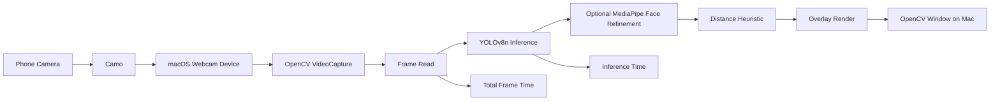

# vision_rt

`vision_rt` is a standalone webcam evaluation module inside `robophone/`.

Run all commands below from:

```bash
cd /Users/arnoldcheskis/Documents/Projects/Archive/Robophysics/robophone/vision_rt
```

The phone is only the camera. The model runs on the Mac.

## What this module is for

Use `vision_rt` to answer three questions:

1. Is `YOLOv8n` fast enough on live webcam input?
2. Are the bounding boxes stable enough for distance estimation?
3. Does optional face refinement improve outlines enough to justify the added cost?

This module does not train models, deploy to mobile, or do classification work.

## How Camo fits in

When you connect your phone through Camo, macOS exposes it as a standard webcam device.

`vision_rt` does not talk to Camo directly. It uses OpenCV:

1. Camo publishes the phone camera as a webcam.
2. OpenCV opens that webcam with `cv2.VideoCapture(camera_index)`.
3. Frames are read from the webcam.
4. YOLOv8n runs on each frame.
5. Optional MediaPipe refinement runs after detection.
6. The result is shown in an OpenCV window on your Mac.

## End-to-end flow



## First: verify the phone is connected

Before running the model, verify that Camo is visible as a webcam.

1. Connect the phone to the Mac.
2. Open Camo Studio.
3. Confirm you can see the phone preview in Camo.
4. In the terminal, list camera indices:

```bash
python3 camera_check.py --max-index 10
```

Expected result:

- you see one or more working camera indices printed
- Camo is usually one of those indices

If you want to preview a specific index:

```bash
python3 camera_check.py --preview-index 0 --width 640 --height 480
```

That opens a raw webcam preview window named `vision_rt camera check`.

If you see the phone image there, the phone is connected correctly and OpenCV can read it.

Press `q` to close the preview window.

## Demo mode

Demo mode is for live visual inspection.

Run:

```bash
python3 demo.py --camera-index 0 --width 640 --height 480

# For Arnold:
up demo.py --camera-index 0 --width 640 --height 480
```

With face refinement:

```bash
python3 demo.py --camera-index 0 --width 640 --height 480 --face-refine-enabled
```

Without overlays:

```bash
python3 demo.py --camera-index 0 --width 640 --height 480 --no-overlay
```

### Where you see the output

The output appears in a live OpenCV window on your Mac named `vision_rt demo`.

When overlays are enabled, the video window shows:

- bounding box around the detected object
- class label and confidence
- estimated distance
- FPS
- inference time in milliseconds
- optional face outline if refinement is enabled

Press `q` to quit.

## Benchmark mode

Benchmark mode is for collecting timing and stability metrics over a fixed number of frames.

Run:

```bash
python3 benchmark.py --camera-index 0 --width 640 --height 480 --frames 300
```

With live overlay during the benchmark:

```bash
python3 benchmark.py --camera-index 0 --width 640 --height 480 --frames 300 --overlay-enabled
```

With face refinement:

```bash
python3 benchmark.py --camera-index 0 --width 640 --height 480 --frames 300 --face-refine-enabled
```

### Where you see the output

You see output in two places:

1. Terminal output after the run finishes
2. Optional OpenCV window during the run if `--overlay-enabled` is passed

The benchmark prints:

- `avg FPS`
- `avg inference time`
- `avg total latency`
- `min latency`
- `max latency`
- `avg bbox IoU stability` when available
- `avg outline jitter` when available

## Timing model

Two different timings are measured on every frame.

### 1. Inference time

`inference_time_ms` is intended to cover only model inference.

In this module it is measured around:

- `model.forward(...)`

This is the closest metric to raw model cost.

### 2. Total frame time

`total_frame_time_ms` covers the per-frame pipeline:

- frame already captured
- detection
- optional face refinement
- optional overlay rendering

Estimated FPS is computed from total frame time.

## Typical test sequence

1. Connect the phone through Camo, preferably over USB.
2. Run `camera_check.py` to find the correct camera index.
3. Preview that index to confirm the phone image is visible.
4. Run `demo.py` without face refinement.
5. Check whether the boxes are stable and useful.
6. Run `benchmark.py` without face refinement.
7. Repeat demo and benchmark with `--face-refine-enabled`.
8. Compare speed and stability.

## Interpreting what you see

If the live overlay looks stable and the benchmark shows roughly `20 ms` total frame time or lower, you are near `50 FPS`.

Use the comparison below:

- lower `avg inference time` means the model itself is faster
- lower `avg total latency` means the whole loop is faster
- higher `avg FPS` means the end-to-end experience is faster
- higher `avg bbox IoU stability` usually means boxes are more stable frame to frame
- lower `avg outline jitter` usually means the refined outline is more stable

## Notes about camera index

The default camera index is `0`, but Camo may appear as `1`, `2`, or another index depending on your Mac setup.

If the wrong device opens, rerun:

```bash
python3 camera_check.py --max-index 10
```

Then test each likely index with:

```bash
python3 camera_check.py --preview-index 1
```

## Notes about resolution and latency

Start with:

```bash
--width 640 --height 480
```

That is the default working point for speed checks.

If latency is too high, keep overlays off and keep face refinement disabled while you measure the detector.

## Current behavior

The module currently selects the primary detection and overlays its distance estimate. It is optimized for evaluation flow rather than full scene analytics.
